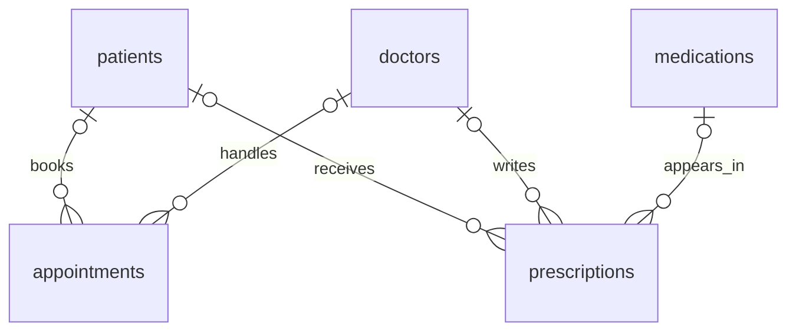

# Schema and relationships

The database contains 12 InnoDB tables. Foreign keys connect records by their
identifiers; names are descriptive fields, not join keys.

## Table guide

| Table | Primary key | Purpose | Foreign keys | Seed rows |
| --- | --- | --- | --- | ---: |
| `department` | `department_id` | Hospital departments | — | 6 |
| `doctors` | `doctor_id` | Doctors and their departments | `department_id` | 8 |
| `nurses` | `nurse_id` | Nurses and their departments | `department_id` | 8 |
| `patients` | `patient_id` | Fictional patient profiles | `department_id` | 12 |
| `rooms` | `room_id` | Rooms, types and recorded status | — | 10 |
| `appointments` | `appointments_id` | Scheduled/completed consultations | `patient_id`, `doctor_id` | 20 |
| `admissions` | `admission_id` | Admission and discharge dates | `patient_id`, `room_id` | 12 |
| `medications` | `medication_id` | Medication catalogue and stock | — | 12 |
| `prescriptions` | `prescription_id` | Medication prescribed by a doctor to a patient | `patient_id`, `doctor_id`, `medication_id` | 20 |
| `medical_tests` | `test_id` | Test records and costs | `patient_id`, `doctor_id` | 0 |
| `payments` | `payment_id` | Payments recorded for a patient | `patient_id` | 15 |
| `audit_log` | `log_id` | Table reserved for future audit logging | — | 0 |

`appointments_id` is the existing table column name. The appointment view exposes
it as `appointment_id` for clearer report output.

## Appointment and prescription relationships

This diagram focuses on the paths used by the two reporting views. `o|` means
zero or one related parent; `o{` means zero or many child records. The foreign-key
columns are currently nullable.

Department membership is separate from the doctor assigned to an appointment or
prescription. A patient can see a doctor outside the patient's recorded department.

The other relationships are:

| Parent | Child | Meaning |
| --- | --- | --- |
| `department` | `doctors`, `nurses`, `patients` | Department assignment |
| `patients` | `admissions` | A patient may have multiple stays |
| `rooms` | `admissions` | A room may host multiple stays over time |
| `patients` | `medical_tests`, `payments` | Tests and payments belong to a patient |
| `doctors` | `medical_tests` | A test records the associated doctor |

## Constraints and design choices

- Primary keys use `AUTO_INCREMENT`; tests and reports do not require gapless IDs.
- Foreign keys reject nonexistent parents, but allow `NULL` for optional links.
- UNIQUE constraints cover department names, staff/patient emails, patient contact
  placeholders, room numbers and medication names.
- CHECK constraints require positive salaries, prices, test costs and payments,
  and nonnegative medication stock. These columns remain nullable in this schema.
- `discharge_date IS NULL` identifies an active admission. Admission and discharge
  dates are not yet constrained against each other.
- Money columns retain the learning project's original types: integer values for
  payments, prices and test costs; `DECIMAL(10,3)` for doctor salary. No currency
  conversion or invoice reconciliation is implemented.
- Status values are flexible text fields with defaults; there are no validation
  constraints for allowed status transitions.

## Reporting views

| View | Row represents | Join path |
| --- | --- | --- |
| `patient_appointment_view` | One appointment | Appointment → its patient and its assigned doctor |
| `patient_medication_view` | One prescription | Prescription → its patient, prescribing doctor and medication |

Both views include record IDs as well as names. LEFT JOINs retain events with
missing optional relationships. The querying account must have the relevant
SELECT permissions because the views use `SQL SECURITY INVOKER`.
